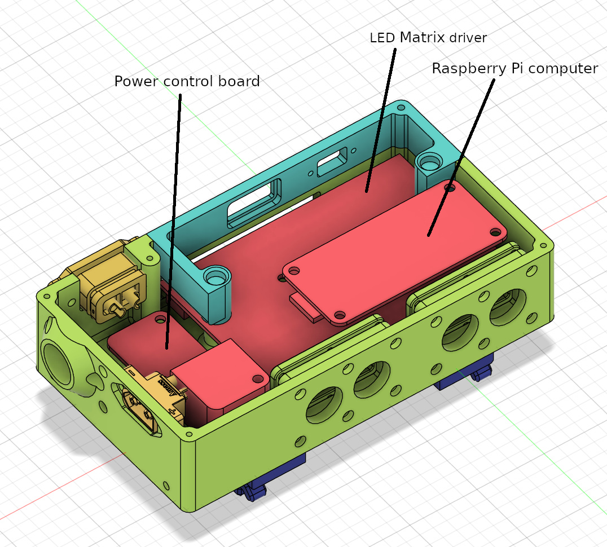
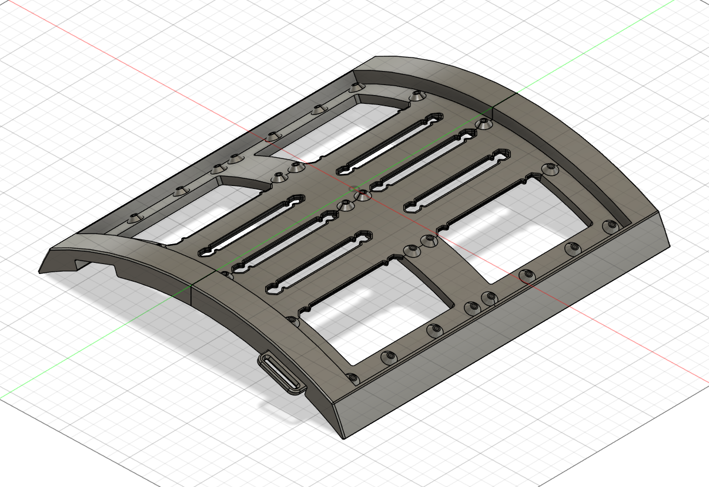
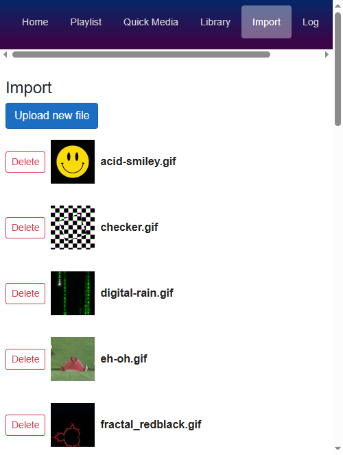
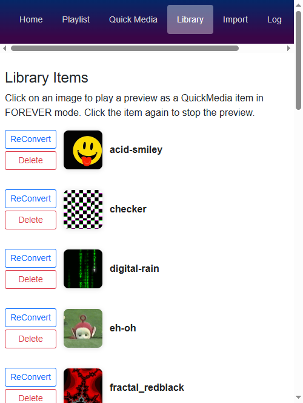
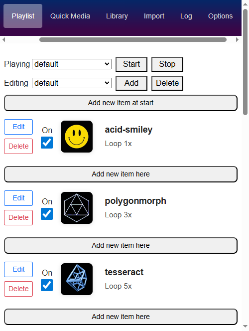
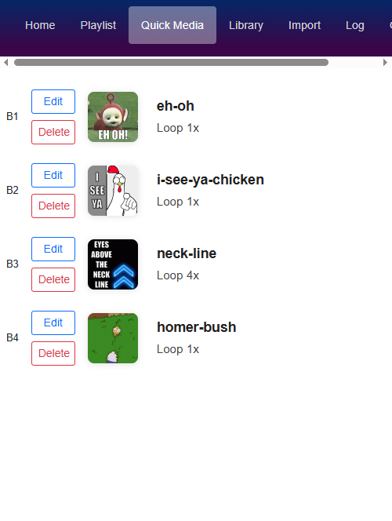
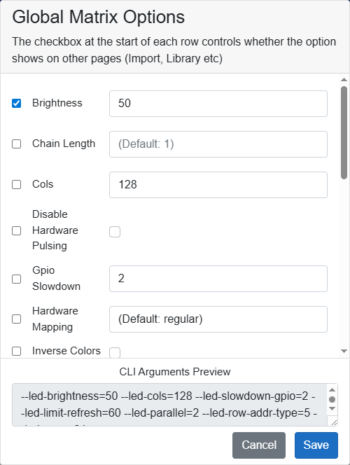

This page is intended to answer various questions I get asked when wearing my t-shirt, and provide some general information about it.

# General FAQ

- Where did you get it?  
  It's not an off-the-shelf product, I made it.  
  It took knowledge of computer programming, Computer Aided Design (CAD), 3D printing and electronics.

- How long did it take?  
  300+ hours. Mostly the programming and CAD  
    To rebuild it from scratch now that I have the code and CAD would probably take me 2-3 days

- How much did it cost?  
  I have spent over £300 to get to this point, but I spent a bunch of money on dead-ends and things I did not end up using.  
  Bill of materials to make one would probably be in the order of £250

- Will you sell me one?  
  No. I could not make any guarantees that it would not break within 5 minutes.  
  I would, however, be happy to supply you with the CAD files and software so you can make one yourself.

- Is it just an iPad attached to a t-shirt?
  (No seriously, I get asked this a lot)  
  No, it's not a screen in the normal sense, it's an "LED Matrix" - literally individual LEDs soldered to a flexible circuit board. They are generally used to make advertising hoardings.

- What does it consist of?  
  
  - Two 128x64 pixel panels, one on top of another
  - A Raspberry Pi miniature computer running Linux
    This runs custom software that I wrote
  - A LED matrix driver board to run the panels
  - Other sundry electronics

- How do you control it?
  
  The Pi computer runs a WiFi hotspot, which I connect my phone to.  
  
  It also runs a web server which has a UI on it that allows me to control what is in the playlist, and configure the 4 "QuickMedia" buttons that I have on the case of the Pi. These allow me to play quick contextual animations ("Hello" etc) that interrupt the normal playlist.

- Is it heavy?  
  It's not too bad. The panels are mounted in a 3D printed frame, and there is a strap which goes around my neck which supports most of the weight. It's more bulky than heavy.

# Pictures

## Hardware

### Case

The 3D printed case containting the Raspberry Pi computer and other electronics
I wear this on my belt. The blue and yellow buttons are the QuickMedia buttons that I use to trigger contextual animations. The red button is the power button. The yellow connector on the left is the main input power, and the yellow connector at the top is output power to the LED panels.

A CAD rendering of the case.

### Panel frame

The back of the frame + panel assembly.
The frame is 3D printed and holds the two panels in place and sets their curvature.

The grey ribbon cables carry image data to each of the two panels, the red+black cables are for power.

A CAD rendering of the frame for the panels

## Software

Runs as a web page on the Pi. Accessed using my phone.

### Import page

Allows uploading of new media. Once imported, will convert files from the original format (GIF etc) into an uncompressed stream, to reduce processing time when played.

### Library page

Lists all available streams that have been imported and converted

### Playlist page

Allows you to manage playlists.
This controls which animations play, and in what order

### QuickMedia page

Allows you to configure what the 4 buttons do

### Options page

Allows you to set the options which match the type of LED panels that you have

